{::nomarkdown} Image Classificaation in Spark       body { position: relative; } #section1 {padding-top:50px;height:200px;} #section2 {padding-top:50px;height:800px;} #section3 {padding-top:50px;height:1500px;} #section4 {padding-top:150px;height:2500px;} #section4 {padding-top:150px;height:500px;}  $(document).ready(function(){ $("#knn-table").hide(); $("#knnbtn").click(function(){ $("#knn-table").show(); $("#neural-table").hide(); }); $("#neuralbtn").click(function(){ $("#knn-table").hide(); $("#neural-table").show(); }) }) 

[Cloud Computing](#)

*   [Introduction](#section1)
*   [Dataset](#section2)
*   [Team Members](#section3)
*   [Preprocessing](#section4)
*   [Algorithms](#section5)

Distracted Driver Detection
===========================

According to the CDC motor vehicle safety division, one in five car accidents is caused by a distracted driver.

Given a dataset of 2D dashboard camera images, Kaggle is providing the dataset to classify each driver image.

For our final project, we decided to work on predicting whether an image can be classified into different categories with Apache Spark using OpenCV.

Dataset
=======

We got this dataset from Kaggle. Link is here ([Take me to the Kaggle.](https://www.kaggle.com/c/state-farm-distracted-driver-detection)).

Input data has 10 categories where each category has images shows driver is doing something.

The 10 classes in the training set are:

1.  c0: safe driving
2.  c1: texting - right
3.  c2: talking on the phone - right
4.  c3: texting - left
5.  c4: talking on the phone - left
6.  c5: operating the radio
7.  c6: drinking
8.  c7: reaching behind
9.  c8: hair and makeup
10.  c9: talking to passenger

Our goal is to predict what the driver is doing in each picture

Project Group
=============

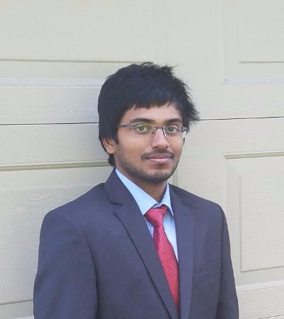

#### Saikalyan Yeturu

Preprocessing 25%

KNN 40%

NeuralNetwork 30%

Evaluation 30%

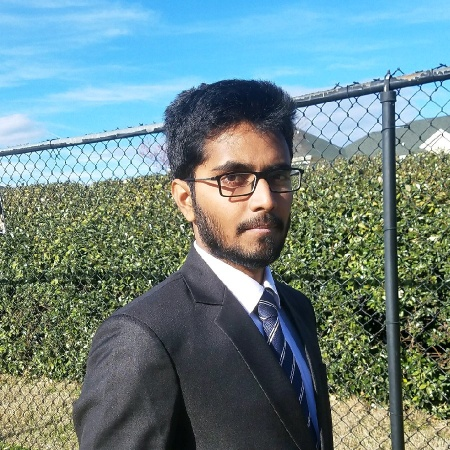

#### Vamsi Krishna Kovuru

Preprocessing 50%

KNN 30%

NeuralNetwork 40%

Evaluation 40%

#### Vivekananda Adepu

Preprocessing 25%

KNN 30%

NeuralNetwork 30%

Evaluation 30%

Preprocessing
=============

Applying machine learning algorithms directly on raw images does not give positive results. So images must be pre-processes before using them for training.

Some of the pre-processing steps for any type of image classification are mentioned below.

Original Image given in the Dataset:

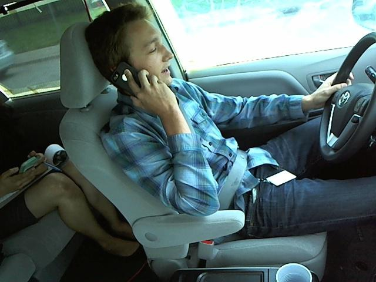

Aplying Grey scale and Bulrring techniques to the images:

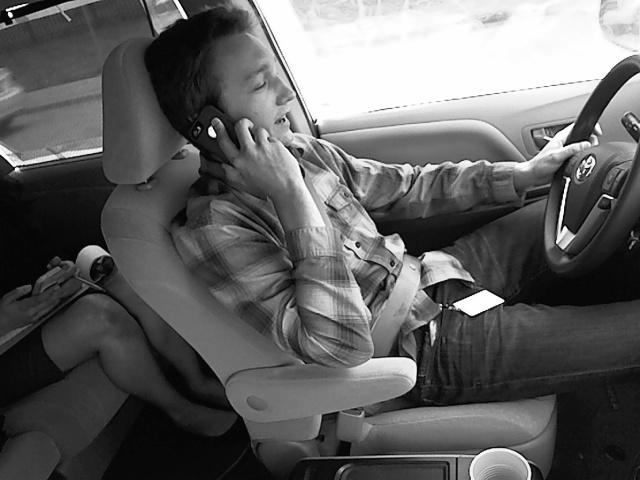

  
  

Aplying Edge Detection to the images:

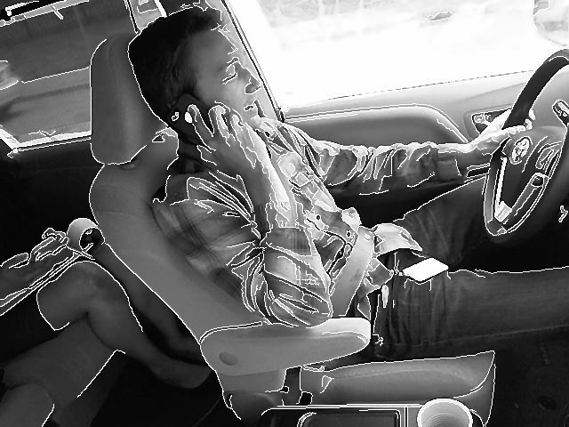

Using key point descriptors to identify edges.

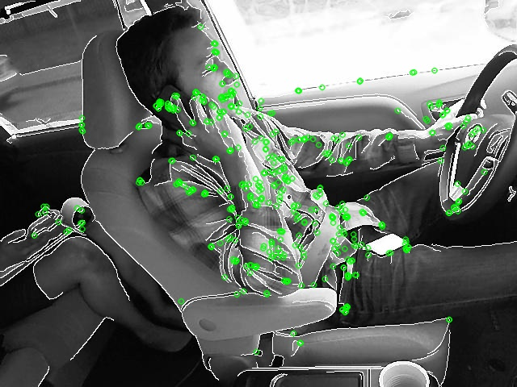

  

Cropping the images.

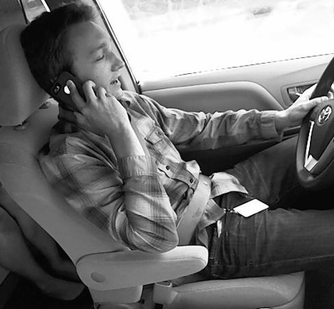

Applying Fore-ground reduction techniques to the images.

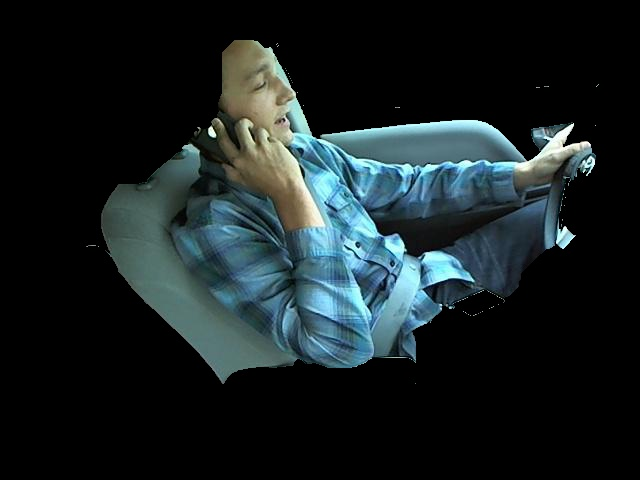

Feature Engineering:
====================

Main challange involved in image classification is **Feature Engineering.**

The dataset on which we have worked is about detecting whether is driver is distracted or not. So face and hands of the driver are most important features of the image.

Some of the methods used for the Feature Engineering are mentioned below.

Applying Threshold Segmentation to extract Face and hands.

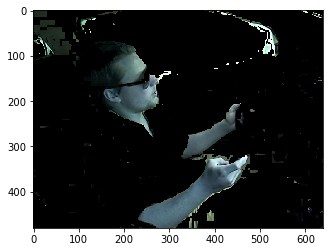

Resizing the image to 50 x 50 for the easy processing.

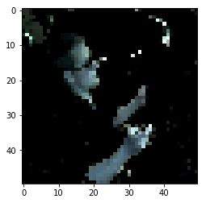

Algorithms Implementation:
==========================

Neural Networks:
----------------

K-Nearest Neighbours:
---------------------

Results:
========

Show KNN results Show Neural Network results

KNN results:
------------

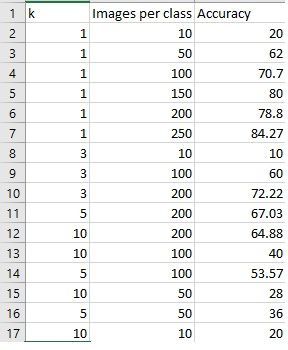

Neural Network results:
-----------------------

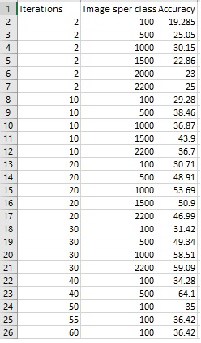

{:/}